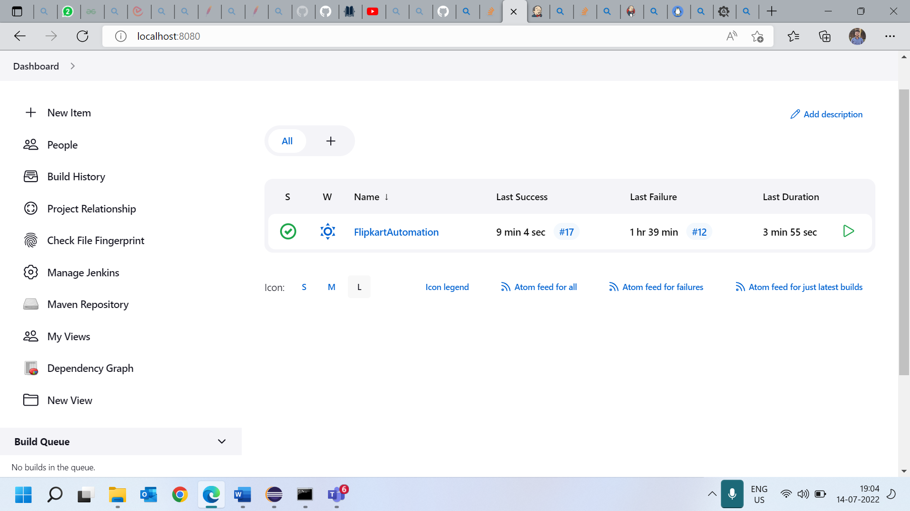
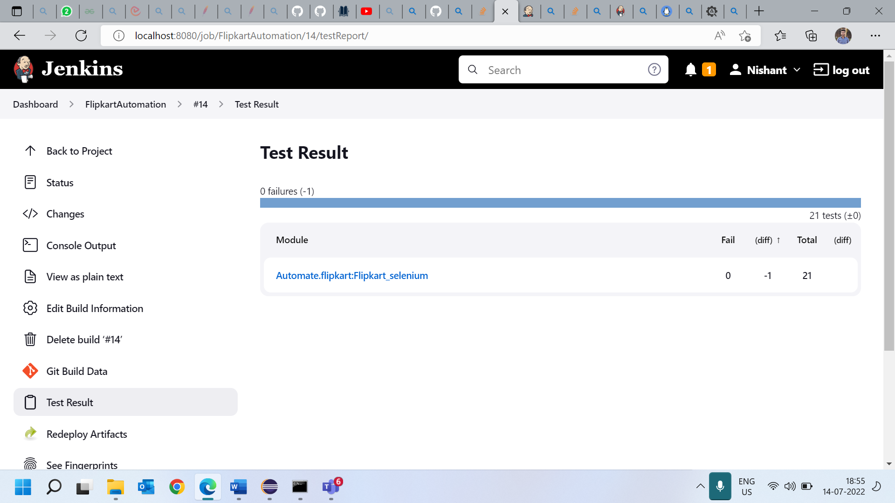
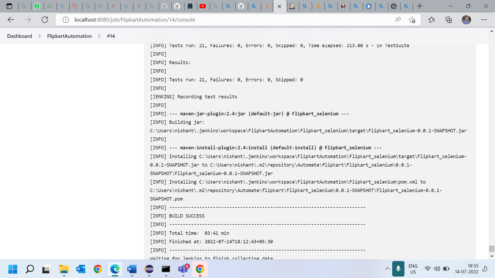

# Flipkart Website Automation Suite Information:
##### To run the Flipkart Automation Suite from command line in the project folder
mvn clean test

## GitHub Repository link 
*  https://github.com/nishant23445/AutomationFlipkart.git

#### Testng files description
* testng.xml: define the tests related to different pages across the site

## Jenkins ( Run with jenkins )  
1. Install Jenkins.war
2. open cmd with jenkins path and write :
		java -jre jenkins.war
		
## Screenshots 

#### Packages description
* com.Flipkart_selenium_Pages- Defining all the pages actions and the respective object repository.
* com.Flipkart_selenium_utils- Defining all the utilities needed for the tests.
* com.FLipkart_selenium_tests- Defining all the pages tests and assertions.

#### Tests.java files description
**Base_Test** : The main class which defines-
* @BeforeMethod- to open the browser, to open url and get the name of the test
* @AfterMethd- to attach screenshot and to quit the browser
* @BeforeSuite- to set Extent
* @AfterSuite- to end the report

**Home_Test** : check functions on the homepage of Flipkart. Includes tests:
* check Flipkart Logo. 
* check ship button.
* check cross Button to close the login dialogue box. 
* check Seach Button.
* check the sorting by popularity.
* check Wholesale button.
* check Paymenttton. 
* check sellerRegistration Button.
* check cart button present on Home page.

**Account_Test** : check functions on the account section of Flipkart. 
Includes tests:
* check wishlist in my profile option.
* check Mychats in my profile option.
* click on mobile button.
* check supercoinZone page by clicking supercoin button 
* click on grocery button available after login on HomeScreen* click on mobile button  

**Login_test** : Check login functionality by  entering mobilenumber and password and clicking login button present on dialogue box . 
Includes tests:
* check login with valid login credentials.
* check login with Invalid login credentials.
* check otp button
* check logout button

**MoreOptions_test** : checks the fuctionalities in more option present in home page .
Includes tests:
* check Notification button by clicking and redirect to notificationpreference page
* check customerService button by clicking and redirect to customerservice page.

**Flight_test** : check the flight button and the serch button in flight page.
#### Drivers Folder description:

* chromedriver.exe : drivers for chrome
* geckodriver.exe : drivers for firefox
* msedgedriver.exe: drivers for microsoft edge

#### Other files description
* **Screenshots.java** : defines functions to take screenshots
* **confi.properties** : placed under "./Resources/config.properties". By changing the value of "chooseDriver" and "mode" you can run the project on different browsers:

** For firefox without headless mode** : chooseDriver= "FireFoxDriver"  and mode="normal"

**For chrome in headless mode** : chooseDriver= "ChromeDriver"  and mode="Headless"

** For chrome without headless mode** : chooseDriver= "ChromeDriver"  and mode="normal"

** For Microsoft Edge without headless mode** : chooseDriver="MicrosoftEdge" and mode="normal"

** For Microsoft Edge without headless mode** : chooseDriver="MicrosoftEdge" and mode="Headless"

* **ExcelFile

#### Reports 
* Extent report gets generated after the run under ./Reports/ExtentReports.html.
* TestNG report as "emailable-report.html" gets generated under /test-output.

#### FailedScreenshots
* Failed Screenshots gets placed under /FailedScreenshots
 
 
## Implemented features

-	Create at least 20 automated Test Case across different flows and screens. - **done**
-	Implement POM (Page factory)  - **done**
-	Test data should be read from excel. User has the ability to selective run the test cases by marking yes in the "Execution Required" field in excel. - **done**
-	Use config files for Global Parameters usage. - **done**
-	Use proper waits i.e., implicit wait and explicit wait wherever necessary. - **done**
-	The test should run on following browsers IE, Chrome, FF. - **done**
-	There should be an option to run the test cases in headless mode. - **done**
-	Use Grouping, Priority, and enable/disable when creating the TestNG Test Cases. - **done**
-	Assertions should be used properly throughout the suite. - **done**
-	Put proper assertions and error screenshot in the extent report. - **done**
-	Create a ReadMe document which has the steps to install and run the code. - **done**
-	Integrate your test suite with Jenkins and GitHub for CI/CD part. - **done**
-	Test Suite should be executable from command line using maven. - **done**
-	Use Logger to implement logging in your test cases. - **done**
